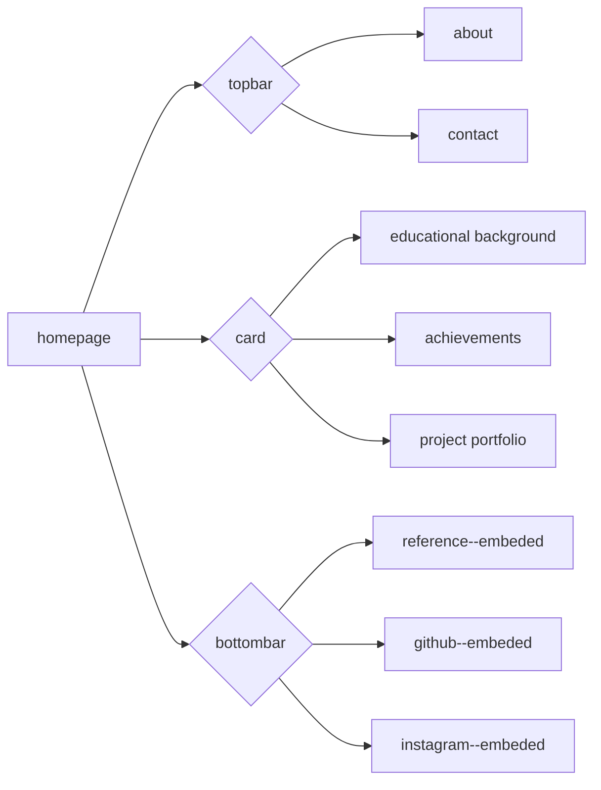

# alonza0314.github.io

## Introduction

This is the first website constructed by myself. I'm still working on making this web better and better. Hope that people can get to know me via this website.

## Reference

|Part|Link|
|-|-|
|FAVICON|[Stickers Cloud](https://stickers.cloud/)|
|PHOTO|[Myself](https://alonza0314.github.io)|
|UI-DESIGN|[UI VERSE](https://uiverse.io/)|
|ADVISE|[ChatGPT](https://chatgpt.com/)|

## Versions Different

+ Large version: complete webpages and a comprehensive visual design
+ Medium version: a new page
+ Small version: a page with some improved

## Architechture

